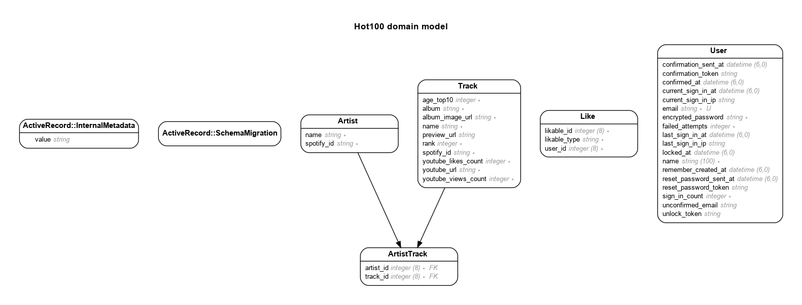

# README

Hot 100: List the Hot 100 songs


Live - https://hot100.dipenchauhan.com

## Model

Generated by Rails ERD. Run rails erd to regenerate (must have graphviz).


## Versions

- ruby 3.1.2p20 (2022-04-12 revision 4491bb740a) [x86_64-linux]
- Rails 7.0.4

## Features

- Song list updated nightly
- Link to Youtube video for the song
- Display Song stats from Youtube
- Like and Dislike a Song
- Create a Playlist
- Bootstrap CSS

## TODO

- Devise Setup
- Login/edit profile (devise) views
- Return to Top button
- User Model
  - id
  - email
  - name
    has_many :likes, as: :likable
- Like Model
  - id
  - likable_id
  - likable_type
    belongs_to :likable, polymorphic: true
- Song Model
  - id
  - name
  - artist
  - published_at
  - youtube_url
  - youtube_likes_count
  - youtube_views_count
  - rank
  - age_top_5

#### Done

## New App Steps

- Create new Rails App using Postgresql database:
  ```sh
  rails new myapp --database=postgresql
  ```
- Update Gemfile

  ```rb
  gem "sassc-rails"
  gem "image_processing", "~> 1.2"
  gem "bootstrap", "~> 5.2.0"
  gem "devise"

  group :development do
    gem "web-console"
    gem "rails-erd" # ERD diagram
    gem "annotate" # Annotate models and routes
    gem "chusaku", require: false # Annotate controllers
    gem "faker" # Fake sample data
    gem "letter_opener" # Preview emails
    gem "erb-formatter" # Format ERB files
  end

  group :test do
    gem "capybara"
    gem "selenium-webdriver"
    gem "webdrivers"

    # New
    gem "rails-controller-testing"
    gem "minitest"
    gem "minitest-reporters"
    gem "guard"
    gem "guard-minitest"
  end
  ```

- Add to database.yml:
  ```yml
  production:
    <<: *default
    database: my_app_production
    username: deploy
    password: <%= Rails.application.credentials.dig(Rails.env.to_sym, :pg_password) %>
  ```
- Install Bootstrap: https://dev.to/overdrivemachines/add-bootstrap-5-and-font-awesome-6-to-rails-7-31b3
- Rails erd:
  - Add .erdconfig file
  ```sh
  echo "attributes: content,foreign_key" > .erdconfig
  echo "filetype: png" >> .erdconfig
  ```
  - Run `bundle exec rails g erd:install`
- Annotate
  - Create routes.rake file
  ```sh
  curl -LJ --output lib/tasks/routes.rake https://github.com/overdrivemachines/dipen_chauhan/raw/master/lib/tasks/routes.rake
  ```
  - Run `rails g annotate:install`
- Devise Install:
  $ rails generate devise:install
- Configure Mailer, add to development.rb:

  ```rb
  # Define default URL options
  config.action_mailer.default_url_options = { host: 'localhost', port: 3000 }

  config.action_mailer.delivery_method = :letter_opener # for letter opener
  config.action_mailer.perform_deliveries = true # for letter opener
  ```

- Create Devise Model, Controllelr and Views:
  ```sh
  rails generate devise user
  rails db:migrate
  rails generate devise:views
  rails generate devise:controllers users
  ```
- Add to routes.rb
  ```rb
  devise_for :users, controllers: {
    confirmations: 'users/confirmations',
    registrations: 'users/registrations',
    sessions: 'users/sessions',
    unlocks: 'users/unlocks',
  }
  ```
- Install the local gems while preventing the installation of production gems
  ```sh
  bundle config set --local without 'production'
  bundle install
  bundle lock --add-platform x86_64-linux
  ```

## References

- Email Validation - https://mailtrap.io/blog/rails-email-validation/
- /:username - https://angelos.dev/2020/04/slash-username-urls-in-rails/
- Resize Images
  - https://dev.to/mikerogers0/resize-images-with-active-storage-in-rails-481n
  - https://www.bigbinary.com/blog/rails-7-adds-ability-to-use-predefined-variants
  - https://www.youtube.com/watch?v=1cw6qO1EYGw
- Save and Delete button - https://dev.to/konnorrogers/escaping-the-traditional-rails-form-4c4o
- Devise User Model with Roles - https://btihen.me/post_ruby_rails/rails_devise_users_namespaced/
- How to check if a record exists:
  - present? => 2892.7 ms
  - any? => 400.9 ms
  - empty? => 403.9 ms
  - exists? => 1.1 ms
  - https://semaphoreci.com/blog/2017/03/14/faster-rails-how-to-check-if-a-record-exists.html
- Iterate through HTMLCollection - https://webcodespace.com/how-to-addeventlistener-to-a-list-of-html-elements-in-javascript/
- Stimulus in Rails 7 - https://dev.to/bhumi/stimulus-rails-7-tutorial-5a6a
- Turbo in Rails 7 - https://blog.corsego.com/turbo-hotwire-CRUD
- JS Naming convetions - https://www.syncfusion.com/blogs/post/10-javascript-naming-conventions-every-developer-should-know.aspx
- Polymorphic likes - https://medium.com/@jamesreed3050/setting-up-polymorphic-likes-in-rails-7d8be2e01c12
- Bootstrap Buttons - https://codepen.io/andrewarchi/pen/RwxyRB
